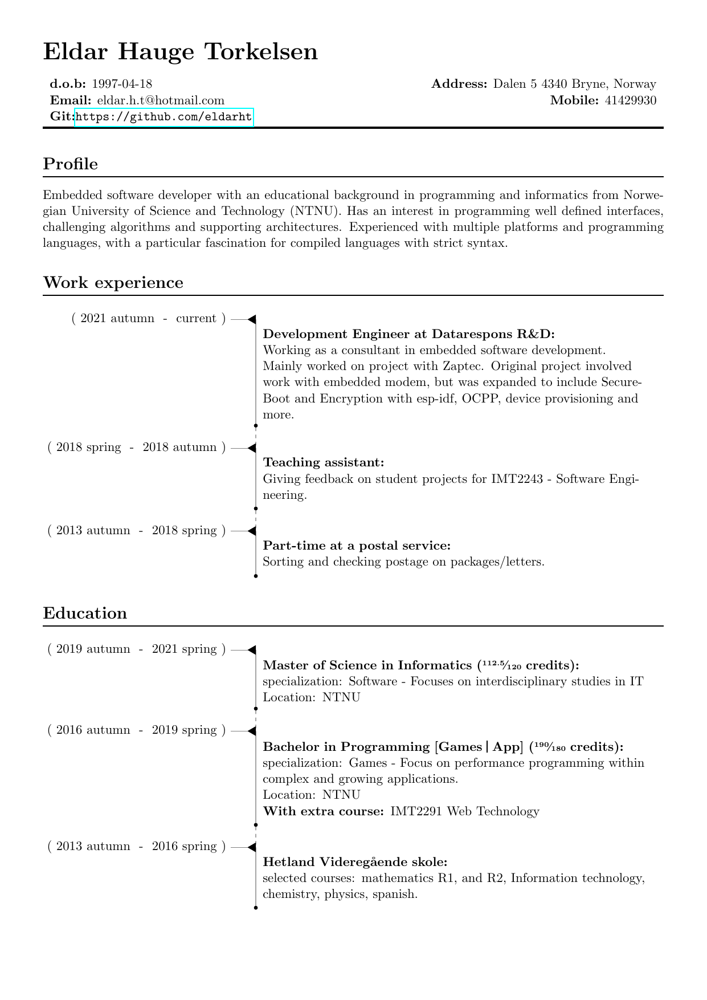
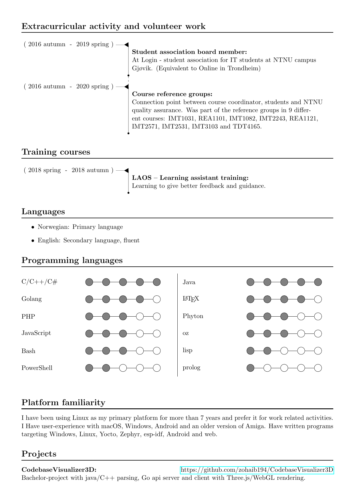

## A crude LaTeX CV class ##
Created for personal use, but you may use it or change it as you see fit.
The image below shows an example output. You can also see an example for a different
language in the example folder. Currently the header (maketitle) is the only
language dependent command and is only implemented for two languages. it
should be trivial to add another language if you need it.

